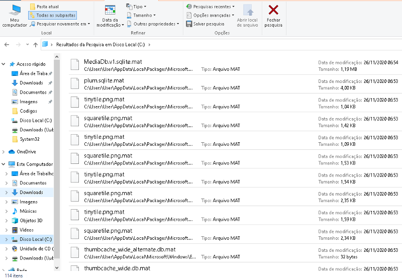
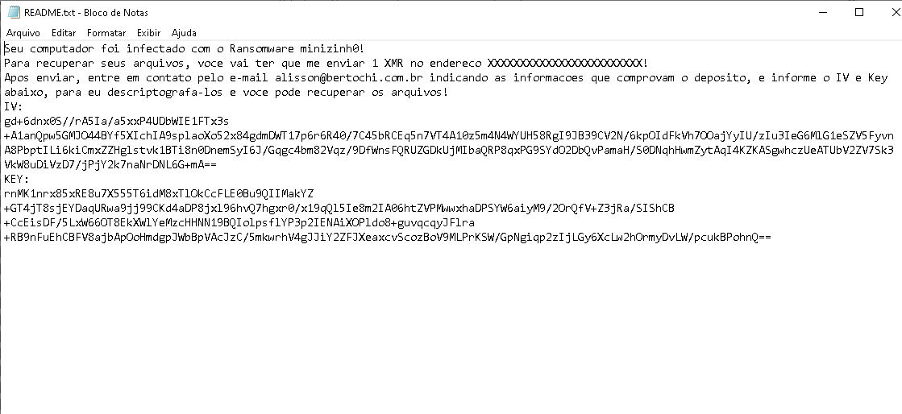

## minizinh0-FUD - A Fully Undetectable Ransomware 

### Introduction

In October, just 4fun, I implemented a generic ransomware called **minizinh0**, which is cross-platform and compiles to Windows and Linux. It has not yet been released, but maybe I will post its source here on my GitHub. 

I did a test running this first version against Kaspersky Cloud Security 21.2.16.590, and it takes around 2 minutes to be detected and blocked by the behavior analysis system. You can see the test [in this video](https://youtu.be/M3qOuKtSS30). The result was a compromise of 114 files (in my opinion, a big damage!), as can be seen below:

Anyway, despite the damage, I don't like to lose to AVs, so I decided to use the technique of User Imitation, which I did a [PoC Fully UnDetectable](https://github.com/gnxbr/Fully-Undetectable-Techniques/tree/main/user-imitation) some days ago, to make a FUD Ransomware called "minizinh0-FUD". I got the core idea from Tim's paper and created my version using my minizinh0 "non-FUD" as a template. The result was a success! I was able to encrypt the filesystem under the nose of the Antivirus (heh).

Because I think we'll see something like this being used in the wild soon, **I decided to release the PoC before the criminal minds start using, so the good guys will have time to think about solutions.**

I didn't implement most of the real features of a Ransomware, like deleting shadow copies, finding other partitions and shared network drives, one key attached per file, etc. It's just a PoC (maybe with some bugs)! :)

### How it works

minizinh0-FUD works on a hidden secondary desktop. It takes the path of the current user, and starts walking X levels (configurable) in-depth, looking for files with extensions that are on the list: docx|pdf|xlsx|pptx|ppsx|kdbx|sqlite|zip|rar|jpg|png|html|htm. When a target file is found, the ransomware moves it (simulating the user) to %TEMP%\temp.png, opens it (ReadFile), encrypts it and saves (WriteFile) to %TEMP%\temp.mp3. Next, it moves (simulating the user) the file temp.mp3 (target file encrypted) to the Original Path + .mat extension (e.g., C:\important-file.db.mat), creates a Ransom Note in the directory with the echo command, and go to the next one.

I'm encrypting the Key and IV of AES-CBC 128-bit with my RSA Public Key 2048-bit. I use the same Key/IV for all files. By decrypting it, the victim can recover their files.

One of the disadvantages of minizinh0-FUD, is that the process of encrypting each file takes more time than a "normal ransomware" because as we always use the same names, we have to wait for the file "to be released" before moving on to the next one.

### minizinh0-FUD demo, have fun :)

Ignore the debugging messages.

[PoC Video against Kaspersky](https://youtu.be/2a4wEv9FcmA)

[PoC Video against ESET](https://youtu.be/JBFmOi4_G0M)

**May 2021**: Tested against CrowdStrike EDR — it was not detected and didn't even generate telemetry.

**August 2025**: Tested again against CrowdStrike — still not detected, even with the policy set to "Extra Aggressive" and all options enabled.

**August 2025**: Tested against SentinelOne EDR — it is only detected when the "Detect Interactive Threat" option is enabled. The cmd.exe process running in the hidden desktop is killed, but the binary responsible for orchestrating the execution is not identified. This means it could be executed again as many times as needed, and if the execution is done in stages/batches (encrypting fewer than ~600 files each time), I believe the objective could be achieved without EDR interference.

### My Ransom Note (in pt-br)

### Source

Use it to think about solutions in how to defeat this very cool technique!

[minizinh0-FUD.c](src/minizinh0-FUD.c)

### Get in touch

If you wanna talk more about these techniques, get in touch via Telegram (@gnxbr) or e-mail (alisson[at]bertochi[.]com[.]br). 

Follow me on Twitter: [@alissonbertochi](https://twitter.com/alissonbertochi)! :)

