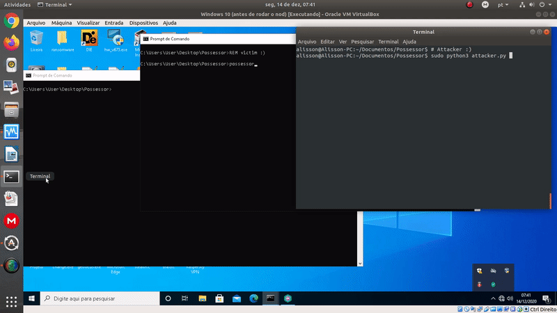

## Possessor - Impersonating Users Through Connect Back



### Introduction

Continuing with my User Imitation's Saga, I created a tool called "Possessor", which can be used to impersonate users through connect back, and send commands to the target machine as if you were them! Currently, you have three options: either send commands to **powershell** or **cmd**, or **write files** directly in the *%TEMP%* folder. You can easily switch the option on the fly, as can be seen in the [Demo](#demo).

As you are executing commands simulating the user, the Antivirus won't bother you.

### Target Audience

This tool can be useful for Red Team Operations and Pentesting.

### How it Works

#### Target/Victim Side (Windows)

To compile:

**Important:** Before compile, change the word "Explorador" (that is in Portuguese) to the title of the window of explorer.exe in your system's language.

```
gcc -c base64.c
gcc possessor.c -o possessor.exe base64.o -l ws2_32
```

The target (victim) side was written in C. It will open a hidden secondary desktop, and a window for cmd.exe and another for powershell. Then, it will connect back to the Attacker Side using the configured IP and Port, to receive commands. The major advantage of "Possessor" is that the commands are executed/typed using the [User Imitation technique](https://github.com/gnxbr/Fully-Undetectable-Techniques/tree/main/user-imitation), which is not suspicious behavior for security solutions.

The received commands will be delivered directly in the corresponding window, and the "writefile" function uses the cmd's window. The output is always saved in the file *%TEMP%\result.txt*.

Currently, the data is transmitted encoded as *base64(x0r single byte)*, just so the traffic is not in plain text.

#### Attacker Side (Linux)

The attacker side was written in Python for flexibility. Basically, it will start listening and wait for the target's connection. When the connection arrives, it will open an interactive prompt to send commands. The interaction is partially blind, because if your command needs any confirmation, you will not see the screen (but you can send the response), and the output is always saved to and read from the file *%TEMP%\result.txt*.

Internally, before the command is sent, the spaces are replaced by **@** (at), so they can be interpreted correctly in the target side.

If the command that you are running took more than 1 second to generate its output, you will need to wait for a while and type [**readout!**] to get the result.

If the command does not generate any output (like *cd path*), you will only receive back the message "Executed!".

The buffer size is *4096*, so you cannot send commands that when encoded are longer than *4096* characters.

[**1**] **PowerShell:** you can send commands to be executed in the powershell window. E.g.: *Get-ComputerInfo*, *Get-ExecutionPolicy*, etc. The output is saved with the following redirect: **| Out-File -FilePath $env:TEMP/result.txt -encoding utf8**. This needs to be taken into account because it can impact the execution of some commands.

There is a special command, called [**enable-scripting**], that changes the Execution Policy of the Current User to "Unrestricted", so you can execute scripts. To confirm the change, send *Get-ExecutionPolicy*.

[2] **cmd.exe:** you can send commands to be executed in the cmd window. E.g.: *ipconfig*, *type path/file*, etc. The output is saved with the following redirect: **> %TEMP%\result.txt**. This needs to be taken into account because it can impact the execution of some commands.

When you use *copy* or *move*, the cmd.exe is configured by default to overwrite the target file without asking for confirmation. If you wanna change this, send *set "COPYCMD="*. In this case, after send some *copy*/*move* command, you will need to send the confirmation message (in the target system's language).

[3] **Write Files:** the syntax is [**filename.ext content here with spaces**]. The file will be saved in the *%TEMP%* folder with the specified filename. The **echo** command is used in the cmd window to generate the file (*echo content here >> %TEMP%\filename.ext*). If you want to send **\n (line break)**, to write a file with multiple lines, use # (hash symbol) in the content...

[**script.ps1 line1 with its content#line2 with its content#line3 with its content**]

... **or** split into multiple lines, like:

[**script.ps1 line1 with its content**]

[**script.ps1 line2 with its content**]

[**script.ps1 line3 with its content**]

**Other Commands:**

[**change**]: back to the options menu.

[**readout!**]: if the command sent took more than 1 second to generate the output, you will need to send [**readout!**] to get the response.

[**kill!**] or <CTRL+C>: kills the target side, closing the opened windows (Explorer, Powershell and cmd) and stop running.

[**quit!**]: close the attacker side, but the target will keep running, and unless you have another malicious binary running to control the machine, you cannot recover the connection.

[**help**]: show the help menu.

[**clear**]: clean the attacker's screen.

### Source

Have fun: [src folder](src/)

### Bugs

Well, it was written in C, so you can expect some bugs, surely. Contact me if you find something wrong, or open a Pull Request! :)

### Contact

If you wanna talk more about these techniques, get in touch:

* **Telegram:** [@gnxbr](https://t.me/gnxbr)
* **Twitter:** [@alissonbertochi](https://twitter.com/alissonbertochi)
* **E-mail:** alisson[at]bertochi[.]com[.]br
* **Linkedin:** [https://www.linkedin.com/in/gnxbr/](https://www.linkedin.com/in/gnxbr/)

### Greetz

I would like to thank my friends [pdpano](https://twitter.com/pdpano2) and [eremitah](https://twitter.com/eremitah) for reviewing this work! :)

### Demo

Ignore the debugging messages.

[Watch on YouTube](https://youtu.be/SW_kHwgWrMU)


