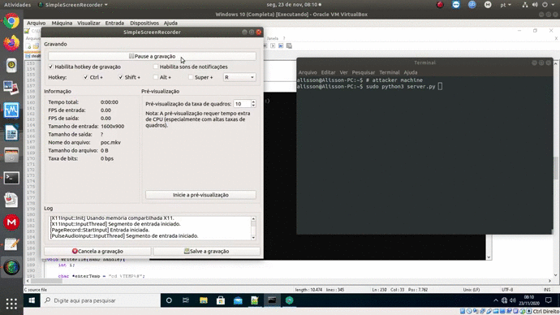
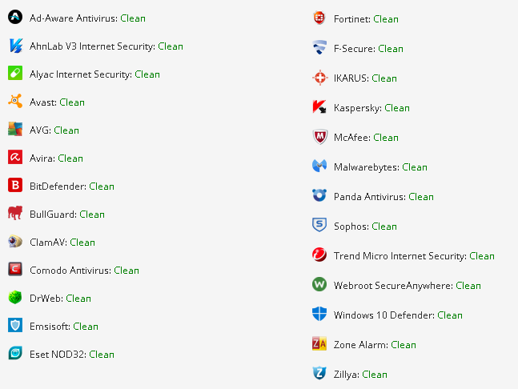

# User Imitation

I have coded my own [PoC](stealth.c) (in pure C) for the novel technique explained by Tim Niklas Witte in his paper "[Phantom Malware: Conceal Malicious Actions From Malware Detection Techniques by Imitating User Activity](https://ieeexplore.ieee.org/abstract/document/9186656)", released in September. 

The basic idea is to make something like a "[Rubber Ducky](https://shop.hak5.org/products/usb-rubber-ducky-deluxe)", but from software and stealthy. We can use a hidden secondary desktop to imitate a user, bypassing the AVs' behavior analysis.

I was able to create my own **Fully UnDetectable (FUD)** Proof of Concept, with the simple goal of launch a tiny visual basic reverse shell script available [here](https://github.com/cym13/vbs-reverse-shell), running with the native binary "cscript" as if it were a regular user.

In runtime, it was tested against the latest version of Kaspersky Internet Security (21.2.16.590) and Avast (20.9.2437, compilation 20.9.5758.615), on November 23.

In scantime, the result can be seen below:

**PoC video 1:** Showing the hidden desktop and the execution of the commands to facilitate the understanding:

[https://youtu.be/JM0PVbpAJ3c](https://youtu.be/JM0PVbpAJ3c)

**PoC video 2:** Not showing the hidden desktop and the execution of the commands simulating a real attack (but with some verbose for debugging purposes):

[https://youtu.be/Zib72w92ukk](https://youtu.be/Zib72w92ukk)

Well, I didn't have to make much effort to achieve my goal. I just needed to understand the technique's concept. I think there are infinite ways to make the payload stealthier (if really necessary), so the AVs have a bigger problem dealing with it. :)

The security companies, and all the others, need to find ways to avoid this new kind of **tricky attacks**. With creativity, the attackers can create very interesting and stealthy payloads. For example, Tim introduced a cool idea of Ransomware in his paper that I think we will see in the wild soon.

If you wanna talk more about these techniques, get in touch via IRC (gnx @ freenode), Telegram (@gnxbr) or e-mail (alisson[at]bertochi[.]com[.]br).

That's all folks.

